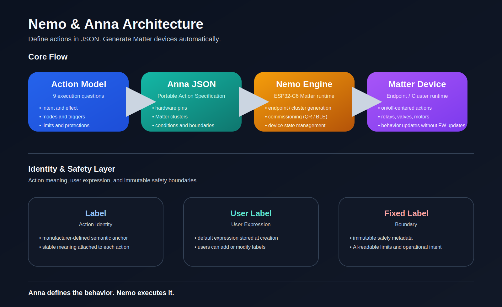

# Nemo & Anna


**Action-based Matter Device Platform**

*An Action-first approach to building Matter devices.*

Define actions in JSON. Generate Matter devices automatically.



> **Anna defines the behavior.  
> Nemo executes it.**

---

## TL;DR (for developers)

- Matter devices are composed from **Actions**, not Device Types  
- JSON definition → **automatic ESP32-C6 Matter device structure**  
- **Fixed Label** used as safety boundary metadata  
- **GPIO driver-level conflict protection**  
- Not replacing developers, but **simplifying Action model design**

---

## What We Actually Do

1. By answering nine questions, a Matter-compatible smart home device can be defined without writing firmware code.  
2. Execution conditions and safety boundaries are declared at design time.  
3. Nemo & Anna simplify smart home behavior using two core action primitives: **button** and **switch**.  
4. The identity of an action is stored in **User Label**, while constraints and boundaries are declared in **Fixed Label**.  
5. This structure can also be used by LLMs and AI agents to interpret and control actions based on declared boundaries and context, rather than relying on hard-coded rules.

---

## Why Start from Actions Instead of Devices

Traditional IoT platforms usually follow this process:
Select Device Type
→ Add options
→ Map GPIO

Nemo & Anna start from the opposite direction:
Define Action
→ Declare safety conditions
→ Generate device structure

Instead of defining **what a device is**, we define **what a device does**.

This approach enables combinations of Matter device behavior that are difficult to express with traditional template-based systems.

---

## Action Model

**An Action is the set of answers to nine execution questions.**

1. What is the intended action? → Name of Action  
2. What physical effect occurs? → Define the Execution Effect  
3. What boundaries must never be crossed? → Declare the Boundaries  
4. In which mode is this action valid? → Choose When This Action Applies  
5. What event triggers the action? → Detect the Event  
6. What is the goal value? → Evaluate Goal Progress  
7. What is the maximum execution time? → Set the Responsibility Limit  
8. What conflicts must be checked before starting? → Check Start Interference  
9. What protection conditions must be checked before stopping? → Check Stop Impact  

This structure defines a standardized way to describe actions.

---

## Identity (User Label Based)

Identity is applied using **User Label (0x0041)**.

### Definition (Anna JSON)

```json
{ "Label": "Keep Warm" }
```
**Mapping (Matter)**
```json
{ "label": "endpointLabel", "value": "Keep Warm" }
```

**Rules**

Each endpoint MUST have exactly one endpointLabel
The value MUST match the Anna JSON Label
endpointLabel MUST be stored in User **Label (0x0041)**
endpointLabel represents the primary identity of the endpoint
**User Label MUST contain only one entry per endpoint**

---

## Safety (Fixed Label Based)
Safety is applied using **Fixed Label (0x0040)**.

**Definition (Anna JSON)**
```json
{ "Label": "warning", "Value": "thermal-risk" }
```
**Mapping (Matter)**
```json
{ "label": "warning", "value": "thermal-risk" }
```

**Rules**

- Fixed Labels MUST be stored in **Fixed Label (0x0040)**
- Fixed Labels MUST be read-only
- Fixed Labels MUST NOT be modified by users
- Multiple Fixed Labels MAY exist per endpoint
---

## Anna

**JSON Language for Action Definition**

Anna JSON is a **Portable Action Specification**.

> It defines **actions**, not devices.
JSON becomes both the device design and the action definition.

Each JSON includes:
Hardware pin structure
Matter cluster configuration
Execution conditions
Safety boundaries

---

**Example: Anna JSON**
```json
{
  "label": "baby-mobile",
  "OutPin": 18,
  "fixed_label": "safety-limited-rotation",
  "mode": "nursery-mode",
  "max_sec": 1800,
  "not_on_pin": [12]
}
```

This JSON contains answers to the Action questions:
max_sec → automatic stop after 30 minutes (Responsibility Limit)
not_on_pin → execution blocked while heater is active (Start Interference)

---

## Nemo

**ESP32-C6 Matter Runtime Engine**
Nemo is a Matter firmware runtime for ESP32-C6.
It generates Matter devices from Anna JSON.

**Core responsibilities**
Automatic Endpoint / Cluster configuration
Matter Commissioning (QR / BLE)
Device state management
JSON-defined device behavior
Behavior changes without firmware updates

Supported action-based devices:
relays
valves
simple motors
power control systems

---

Architecture Overview

Action
   ↓
Anna JSON
   ↓
Nemo Firmware
   ↓
Matter Device

---

## Summary

Anna defines the behavior.
Nemo executes it.
Define the action first.
The device structure follows automatically.

---

## Interoperability with External Systems

Traditional automation systems often rely on device-specific logic, making integration across systems difficult.

Nemo & Anna define actions, conditions, and constraints in a structured format.

This approach can be used by external systems, including AI-based tools, to better understand device behavior without relying on firmware-specific implementations.

Nemo & Anna do not implement AI control, but expose machine-readable action definitions that can be utilized by other systems.